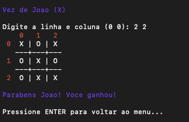

# 🎮 Jogo da Velha em C

Projeto desenvolvido em **linguagem C** como parte dos estudos da disciplina **Programação de Computadores I**.  
O objetivo foi aplicar conceitos básicos da linguagem de forma prática, criando um jogo completo, funcional e organizado.

O jogo é executado no terminal e permite que dois jogadores joguem alternadamente, com validação de jogadas, detecção de vitória e empate, além de um cuidado especial com a interface visual.

---

## 🧠 Conceitos aplicados

Durante o desenvolvimento deste projeto, foram utilizados e praticados os seguintes conceitos:

- Estrutura básica de um programa em C
- Funções
- Vetores e matrizes
- Laços de repetição (`for`, `while`, `do-while`)
- Estruturas condicionais (`if`, `else`, `switch`)
- Validação de entrada do usuário
- Organização e modularização do código
- Uso de códigos ANSI para cores no terminal

---

## 🖥️ Interface do jogo

O tabuleiro é exibido de forma organizada no terminal, com:
- Numeração de linhas e colunas
- Separadores visuais
- Cores para diferenciar jogadores e mensagens importantes

### Screenshot

> 📸 *Imagem do jogo em execução no terminal:*




---

## ▶️ Como executar o projeto

1. Clone este repositório:
   ```bash
   git clone https://github.com/joaopedrocabral/jogo_da_velha_C_UFOP
   ```

2. Compile o código:
   ```bash
   gcc jogo_da_velha_C_UFOP -o jogo
   ```

3. Execute:
   ```bash
   ./jogo
   ```

> ⚠️ Observação: o uso de cores e do comando `system("clear")` funciona corretamente em terminais Linux/macOS e em terminais modernos do Windows.

---

## 🎯 Funcionalidades

- Dois jogadores com nomes personalizados
- Alternância automática de turnos
- Validação de posições inválidas ou ocupadas
- Detecção de vitória (linhas, colunas e diagonais)
- Detecção de empate
- Interface clara e intuitiva no terminal
- Menu inicial para iniciar ou sair do jogo

---

## 🚀 Possíveis melhorias futuras

Algumas ideias para evoluir o projeto no futuro:

- Colorir os símbolos `X` e `O` individualmente no tabuleiro
- Adicionar opção de jogar novamente sem reiniciar o programa
- Criar um modo **Jogador vs Computador**
- Implementar um placar de vitórias
- Melhorar a leitura de nomes com espaços
- Tornar o código mais portátil (remoção do `system("clear")`)

---

## 📚 Observações finais

Este projeto foi desenvolvido com foco em aprendizado e prática.  
Todo o código foi escrito buscando clareza, organização e entendimento da lógica, sem uso de bibliotecas externas ou recursos avançados fora do conteúdo estudado.

Sugestões e melhorias são sempre bem-vindas.

---

## 👤 Autor

**João**  
Estudante de Engenharia da Computação


Universidade Federal de Ouro Preto

---

⭐ Se você gostou do projeto, fique à vontade para deixar uma estrela!
